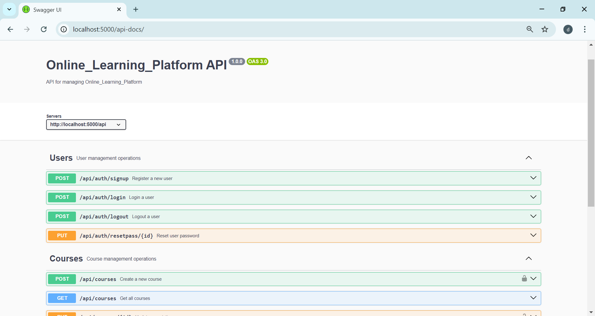
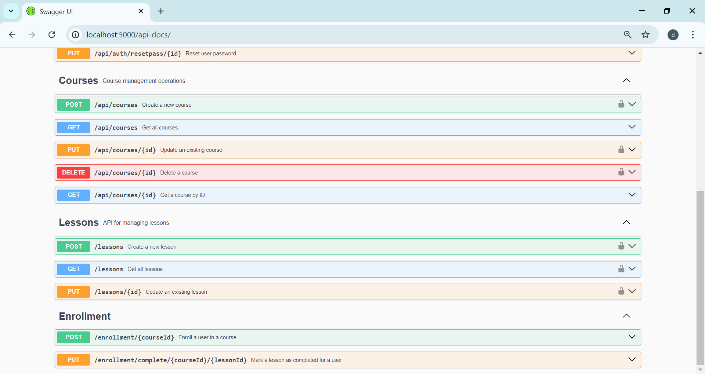

 <h1>online learning platform</h1>

## Expense Swagger UI


<br>


# Course Management Backend

## Table of Contents
- [Introduction](#introduction)
- [Technologies Used](#technologies-used)
- [API Endpoints](#api-endpoints)
  - [User Authentication](#user-authentication)
  - [Course Management](#course-management)
  - [Enrollment](#enrollment)
  - [Progress Tracking](#progress-tracking)
- [Database Models](#database-models)
- [Setup](#setup)
- [Usage](#usage)
- [Security](#security)
- [Contributing](#contributing)
- [License](#license)

## Introduction
This is a RESTful API developed with Express.js for managing courses, user enrollment, and progress tracking. It includes user authentication with JWT, course management for admins, and enrollment tracking for users.

## Technologies Used
- Node.js
- Express.js
- MongoDB
- Mongoose
- JWT (JSON Web Tokens)
- bcryptjs (for password hashing)


## Setup
1. Clone the repository:
   ```bash
   git clone https://github.com/Devanshiballar/Online_Learning_Platform.git


### Setup .env file

MONGO_URL=Your_mongo_url
PORT=Sevice_port
NODE_ENV=NODE_ENVIRINMENT
JWT_SECRET=jwt_secret

### Run this app locally

shell
npm run build

### Start the app

shell
npm start